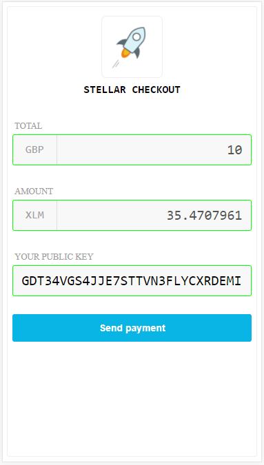

# Example 1
The following example requests a payment of 10 GBP.
The transaction is submitted to the Stellar test network. 

## Simple configuration example
Drop this code into a page on your web site

```html
<div id="elem"></div>
<script type="text/javascript" src="https://unpkg.com/stellar-checkout/stellar-checkout.min.js"></script>
<script>
StellarCheckout.ui.render('#elem', {
  currency: 'GBP',
  total: '10',
  destinationKey: 'GDLZR4NMRB6ZLZ7QTCQ3UVFVS53VBEJ3RSOZ56F4KINZVIS7DVOZ2V4W'
});
</script>
```

## Form
A form is rendered presenting the customer with the "Total" in GBP, the amount of lumens (XLM) and a field to enter their public key.


## Awaiting payment
After a user clicks the "send payment" button, the awaiting payment page appears. This page listens for transactions sent from the customer's public key to the merchant's public key (destinationKey).
The customer should use their lumens wallet to send a payment. FROM, TO & AMOUNT must match the details listed on thie page.


## Payment complete
When the transaction has been received and verified, the payment complete page is displayed.
